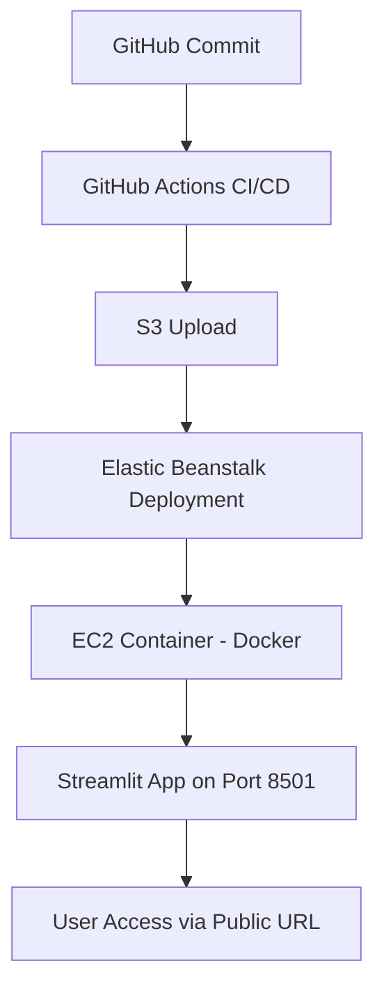

  

# 🏛️ 전세사기피해자 법률 상담 챗봇

> **전세사기피해자 지원 및 주거안정에 관한 특별법**(약칭: 전세사기피해자법) 기반  
> 법률 상담 자동화 챗봇 (Streamlit + OpenAI API)

- **시행일:** 2024.11.11  
- **법률 번호:** 제20429호 (2024.9.10 일부개정)

---

## 📘 Overview

이 프로젝트는 전세사기 피해자의 법률 지원을 위해 구축된 **대화형 챗봇 시스템**입니다.  
Streamlit UI 기반으로 사용자 입력을 받아, 법령 데이터와 LLM을 통해 응답을 제공합니다.  

---

## 🌐 Deployment URLs

| 환경 | 링크 |
|------|------|
| **AWS Elastic Beanstalk (Production)** | **[http://chatbot-law-env.eba-jqza6c2z.ap-northeast-2.elasticbeanstalk.com/](http://chatbot-law-env.eba-jqza6c2z.ap-northeast-2.elasticbeanstalk.com/)** |
| **Streamlit (Demo)** | [https://law-chatbot-mvp.streamlit.app](https://law-chatbot-mvp.streamlit.app) |

---

## 💬 Chatbot Example

**질문:**  
> 전세사기를 당했습니다. 어떤 법적 조치를 해야 하나요?

**응답:**  
> 

---

## ⚙️ Architecture

---

## 🧩 System Components

| 구성 요소 | 기술 스택 | 설명 |
|------------|------------|------|
| **Frontend (UI)** | Streamlit | 사용자 입력/응답 인터페이스 |
| **Backend (API)** | Python 3.10 / LLM API | 전세사기 관련 법률 데이터 처리 |
| **Infra (Deploy)** | Docker + AWS Elastic Beanstalk | CI/CD 및 Auto Scaling |
| **Storage** | S3 | 애플리케이션 버전 ZIP 저장소 |
| **Monitoring** | Elastic Beanstalk Healthd | Health 상태 모니터링 및 로그 수집 |

---

## 🚀 GitHub Actions CI/CD Pipeline

GitHub `main` 브랜치에 **push → 자동 배포**되는 구조로 설계되어 있습니다.

### Workflow 파일
`.github/workflows/deploy-eb.yml`

### 주요 단계
| 단계 | 설명 |
|------|------|
| **Checkout** | 최신 소스코드 가져오기 |
| **Configure AWS credentials** | GitHub Secrets의 IAM 키 로드 |
| **Create application bundle (zip)** | 배포용 ZIP 생성 |
| **Deploy to Elastic Beanstalk** | S3 → EB 환경 자동 배포 |
| **Post cleanup** | 임시 자원 정리 |

---

## 🧠 Environment Summary

| 항목 | 값 |
|------|------|
| AWS Region | ap-northeast-2 (Seoul) |
| Instance Type | t3.small |
| Platform | Docker on Amazon Linux 2023 |
| Environment | SingleInstance (No Load Balancer) |
| App Port | 8501 |
| Health Check Path | `/_stcore/health` |

---

## 📘 Research & Notebooks

| 파일명 | 설명 |
|--------|------|
| `notebooks/rag_retrieval_qa_pipeline.ipynb` | 전세사기피해 법률 문서를 기반으로 한 RAG QA 파이프라인 구현 |
| `notebooks/rag_langserve_langsmith_integration.ipynb` | LangServe 및 LangSmith 연동 실험 (배포 모니터링 테스트) |

> 💡 모든 실험은 `source_documents/` 폴더 내 문서를 사용하며,  
> 생성된 임베딩은 Pinecone Vector Store에 저장됩니다.

---

## 📄 License & Maintenance

- **License:** CC BY-NC 4.0  
- **Maintainer:** youneedpython  
- **Infra:** AWS Elastic Beanstalk (t3.small)  
- **Auto Deployment:** GitHub Actions

---

> 💡 *본 프로젝트는 전세사기 피해자 보호 및 법률 정보 접근성을 향상시키기 위한 비영리적 연구용 챗봇입니다.*
